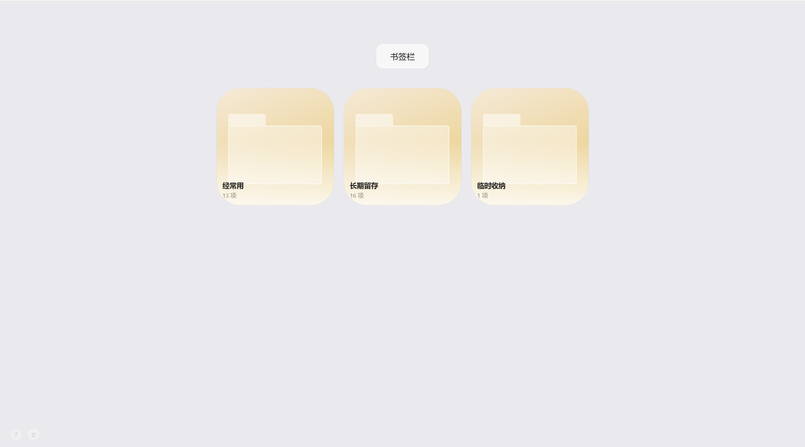
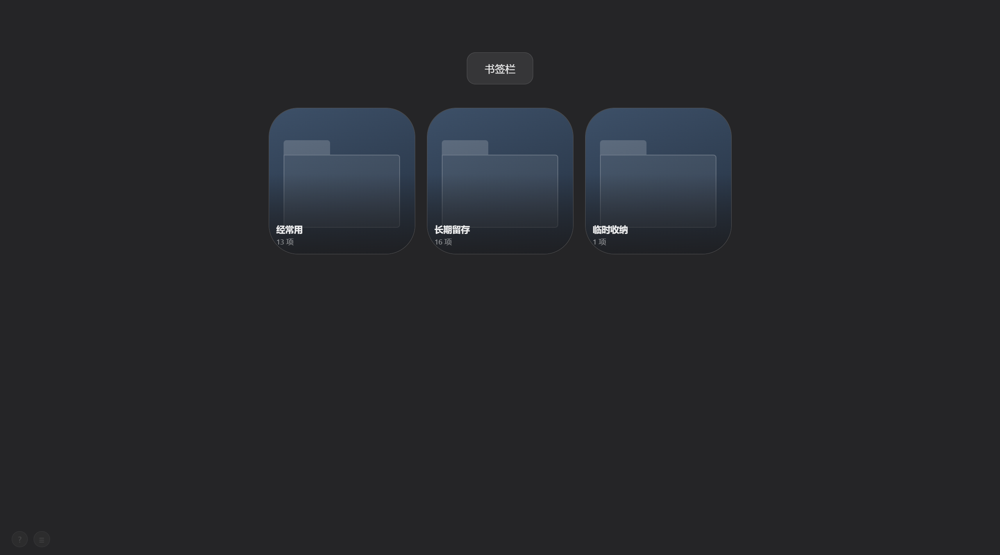

# BookmarkTab

> 一个极简优雅的 Chrome 书签管理新标签页扩展，采用玻璃拟态设计语言，自动跟随系统深浅色模式。

<br>

<table>
  <tr>
    <td></td>
    <td></td>
  </tr>
  <tr>
    <td align="center">浅色模式</td>
    <td align="center">深色模式</td>
  </tr>
</table>

<br>

## ⚠️ 关于数据说明

BookmarkTab 直接读写 **Chrome 原生书签数据**，所有书签的增删改移均作用于 Chrome 本身。

- **书签数据无需单独备份** — 只要开启了 Chrome 账号同步，书签会自动云备份
- **需要备份的是项目专属数据** — 包括自定义图标、壁纸、偏好设置等存储在扩展 `localStorage` 中的内容，这部分数据不随 Chrome 同步，卸载扩展或清除浏览器数据后会丢失

> 数据导出/导入功能正在开发中，敬请期待。

<br>

## ✨ 已实现功能

### 界面与视觉
- 玻璃拟态设计，毛玻璃背景 + 柔和阴影，自动适配系统浅色 / 深色模式
- 书签卡片尺寸可调（`=` / `-` 键），圆角随尺寸等比缩放
- 图标填充整个卡片，支持圆角裁剪
- CSS 绘制的文件夹默认图标（标签页 + 主体造型），深浅模式均和谐
- 左下角快捷键提示面板（悬停显示）
- 左下角设置菜单（与快捷键按钮风格统一）

### 导航
- 面包屑导航，宽度随层级动态伸缩，居中显示，点击任意层级可快速跳转
- 浏览器前进 / 后退支持（`Alt+←` / `Backspace`）
- 快速搜索（`/` 或 `Ctrl+F`），全局书签模糊搜索

### 书签操作
- 右键菜单：重命名、自定义图标
- 自定义图标：支持 PNG / JPG / WebP / GIF / ICO / SVG 文件上传，支持直接粘贴 SVG 代码
- SVG 安全过滤：自动剥离 `<script>`、`on*` 事件、`javascript:` 链接等危险内容
- 书签跳转方式：可在设置菜单中切换「新标签页」/「当前页」打开，持久化保存

### 拖拽交互
- 卡片间拖拽排序（同级重排）
- 拖入文件夹（拖到文件夹中心区域）
- **拖到页面左侧** → 弹出多级文件夹树面板，悬停高亮，松手移动到目标文件夹，超长列表支持自动滚动
- **拖到页面右侧** → 出现删除区域，松手删除

### Favicon
- 自动获取并缓存网站图标（内存 + localStorage 双层缓存）
- 图标加载失败时显示首字母占位

<br>

## 🚧 计划实现

| 功能 | 说明 |
|------|------|
| **数据导出 / 导入** | 导出自定义图标、壁纸、设置等扩展专属数据为 JSON 文件，支持跨设备恢复 |
| **壁纸系统** | 支持自定义壁纸图片，多壁纸切换 |
| **批量操作** | 多选后批量移动、删除 |
| **使用频率统计** | 记录书签点击频次，支持按频率排序 |

<br>

## ⌨️ 快捷键

| 按键 | 功能 |
|------|------|
| `N` | 新建书签 |
| `Shift+N` | 新建文件夹 |
| `/` 或 `Ctrl+F` | 快速搜索 |
| `Backspace` / `Alt+←` | 返回上级文件夹 |
| `↑` `↓` `←` `→` | 卡片键盘导航 |
| `Enter` | 打开书签 / 进入文件夹 |
| `F2` | 重命名选中项 |
| `Delete` | 删除选中项 |
| `Ctrl+Click` | 多选 |
| `=` / `-` | 放大 / 缩小卡片 |
| `Escape` | 关闭弹窗 |

<br>

## 🚀 安装

1. 克隆或下载本仓库
2. 打开 Chrome，进入 `chrome://extensions/`
3. 开启右上角「开发者模式」
4. 点击「加载已解压的扩展程序」，选择项目根目录
5. 打开新标签页即可使用

> 修改代码后，在 `chrome://extensions/` 点击扩展卡片上的刷新按钮，再打开新标签页查看效果。

<br>

## 🗂️ 项目结构

```
BookmarkTab/
├── components/
│   ├── BookmarkCard.js     # 书签卡片（拖拽、右键菜单、自定义图标）
│   ├── BookmarkGrid.js     # 网格容器（渲染、favicon 批量刷新）
│   ├── Breadcrumb.js       # 面包屑导航
│   ├── EditDialog.js       # 新建 / 编辑书签弹窗
│   ├── MoveDialog.js       # 移动书签目标选择弹窗
│   ├── QuickFind.js        # 快速搜索弹窗
│   └── Toolbar.js          # 顶部工具栏
├── core/
│   ├── BookmarkStore.js    # 书签数据层 + favicon 缓存
│   ├── EventBus.js         # 发布订阅事件总线
│   └── Router.js           # 文件夹导航路由
├── css/
│   ├── main.css
│   └── modules/
│       ├── variables.css   # CSS 变量（颜色、间距、圆角、动效）
│       ├── base.css        # Reset + 全局基础样式
│       ├── animations.css  # 卡片动效
│       ├── card.css        # 卡片、拖拽指示线、右键菜单
│       ├── breadcrumb.css
│       ├── dialog.css
│       ├── drag-zones.css  # 拖拽侧边区域（左侧移动面板、右侧删除区域）
│       ├── grid.css        # 网格布局
│       ├── quick-find.css
│       ├── shortcuts.css   # 快捷键提示 + 设置菜单
│       ├── toolbar.css
│       └── wallpapers.css
├── icons/
├── 浅色模式.png
├── 深色模式.png
├── index.html
├── main.js                 # 应用入口，全局快捷键、拖拽侧边区域
└── manifest.json
```

<br>

## 🔒 权限说明

| 权限 | 用途 |
|------|------|
| `bookmarks` | 读写 Chrome 书签数据 |
| `tabs` | 在新标签页 / 当前页打开书签 |
| `storage` | 扩展本地数据存储 |
| `favicon` | 通过 Chrome 内置接口获取网站图标 |

<br>

## 技术栈

- 原生 JavaScript（ES2020+，ES Modules）
- Chrome Extensions Manifest V3
- CSS3（Custom Properties · Flexbox · `backdrop-filter`）
- 无任何第三方依赖

<br>

## License

MIT
